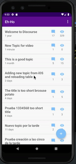

# Fundamentos Android

An android app consuming rest services and using fragments, activities, recyclerview
and coordinator layout effects for a floating action button.
I applied interfaces to share code between fragments and their activities, instantiating fragments with a singleton to pass paramaters. 

